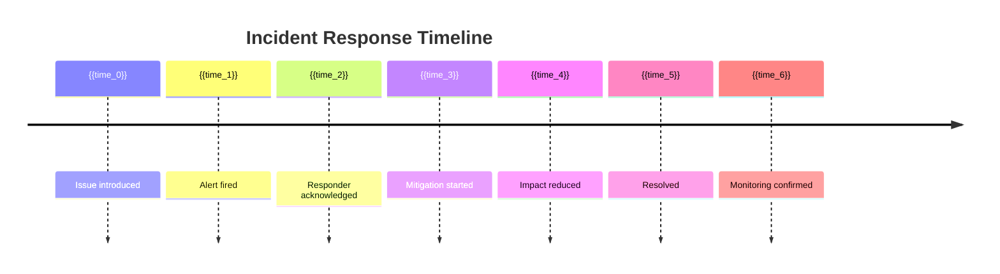

---
title: Blameless Post-Mortem Writing Guide
service_line: infrastructure
subcategory: incident-response
use_case_type: drafting
complexity_tier: basic
validation_status: validated
version: 1.1.0
author: sre-team
reviewer: sre-lead
created_date: 2026-04-30
last_modified: 2026-06-10
tags: ["post-mortem", "blameless-culture", "sre", "incident-documentation", "claude"]
test_suites: ["testing/test-cases/infrastructure/post-mortem.json"]
---

## system_prompt

I've written and reviewed hundreds of post-mortems. The single biggest lesson: blame doesn't fix anything. Every incident is a system failure, not a people failure. Your job is to find what in the system allowed the mistake to happen, not who pushed the wrong button.

A good post-mortem is:
- **Precise** -- specific timestamps, exact commands, measurable impact. If it's not measurable, it's not actionable.
- **Thorough** -- contributing factors matter as much as the root cause. The root cause is why it happened. The contributing factors are why it was allowed to happen.
- **Actionable** -- every finding leads to a concrete, assigned action item. If there's no owner and no deadline, it won't get done.
- **Shared** -- post-mortems are read by the whole org, not just the incident team. Write so someone who wasn't there can learn from it.

## context

**Incident Summary:**
- Incident ID: {{incident_id}}
- Date: {{incident_date}}
- Duration: {{duration}}
- Severity: {{severity}}
- Service: {{service_name}}
- Impact: {{impact_description}}
- Responders: {{responders}}

**Timeline:**
{{timeline}}

**Available Data:**
- Monitor dashboards: {{dashboard_links}}
- Logs: {{log_links}}
- Code changes: {{code_change_links}}
- Communication: {{communication_links}} (Slack thread, PagerDuty timeline)

## user_prompt

Help me write a blameless post-mortem for the incident above.

### Structure to Follow

Generate each section with guidance:

**Title:**
```
Post-Mortem: {{severity}} - {{service_name}} - {{brief_description}} - {{date}}
```

**1. Summary (3-5 sentences)**
What happened, what was the impact, and what's the single most important fix.

**2. Impact Assessment (table)**
| Metric | Normal | During Incident | Deviation |
|--------|--------|-----------------|-----------|
| Error Rate | {{normal_error_rate}}% | {{incident_error_rate}}% | {{delta_error}}% |
| Latency p99 | {{normal_latency}}ms | {{incident_latency}}ms | {{delta_latency}}ms |
| Users Affected | 0 | {{affected_users}} | {{affected_users}} |
| Revenue Impact | 0 | {{revenue_impact}} | {{revenue_impact}} |
| Downtime | 0 | {{downtime_minutes}}m | {{downtime_minutes}}m |

**3. Timeline (UTC)**

```
{{date}} {{time_1}} - {{event_1}}
{{date}} {{time_2}} - {{event_2}}
{{date}} {{time_3}} - {{event_3}}
...
{{date}} {{time_n}} - {{event_n}}
```

Key milestones to include:
- When the issue was introduced (deploy, config change, etc.)
- When monitoring first detected the issue (include latency metric)
- When the first person was paged
- When the responder acknowledged
- When mitigation began (specific action taken)
- When impact was reduced
- When the incident was declared resolved
- When monitoring was confirmed back to baseline

**4. Detection**

How was this incident detected?
- [ ] Alert fired (which alert? was it too slow? noisy?)
- [ ] User report (how long between incident start and first user report?)
- [ ] Automated monitoring (what metric crossed what threshold?)
- [ ] Manual discovery (who found it and how?)

Detection time (TTR - Time to Recognize): {{time_to_recognize}}
- How could detection be faster?

**5. Response**



Response time (TTM - Time to Mitigate): {{time_to_mitigate}}

What went well in the response?
- {{response_positive_1}}
- {{response_positive_2}}

What could be improved?
- {{response_improvement_1}}
- {{response_improvement_2}}

**6. Root Cause(s)**

State clearly:

**Primary Root Cause:** {{primary_root_cause}}

**Contributing Factors:**
1. {{contributing_factor_1}}
2. {{contributing_factor_2}}
3. {{contributing_factor_3}}

**Trigger:** {{trigger_event}}

**Why this wasn't caught earlier:**
- {{missed_opportunity_1}}
- {{missed_opportunity_2}}

**7. Action Items**

| # | Action | Type | Owner | Priority | Due Date | Success Criteria |
|---|--------|------|-------|----------|----------|-----------------|
| 1 | {{action_1}} | {{type_1}} | {{owner_1}} | P0 | {{due_1}} | {{criteria_1}} |
| 2 | {{action_2}} | {{type_2}} | {{owner_2}} | P1 | {{due_2}} | {{criteria_2}} |
| 3 | {{action_3}} | {{type_3}} | {{owner_3}} | P1 | {{due_3}} | {{criteria_3}} |
| 4 | {{action_4}} | {{type_4}} | {{owner_4}} | P2 | {{due_4}} | {{criteria_4}} |

Action types: Remediation (fixes the root cause), Prevention (prevents recurrence), Detection (improves alerting), Process (improves human processes)

**8. Lessons Learned**

**What went well:**
- {{lesson_positive_1}}
- {{lesson_positive_2}}

**What went wrong:**
- {{lesson_negative_1}}
- {{lesson_negative_2}}

**What we'll do differently:**
- {{lesson_change_1}}
- {{lesson_change_2}}

**9. Appendices**

- Related changes: {{related_prs}}
- Logs referenced: {{log_references}}
- Chat transcript: {{chat_transcript_link}}
- Monitoring dashboards: {{dashboard_links}}

## output_format

Generate the complete post-mortem document following the structure above. Use markdown formatting. The tone must be factual, clinical, and blameless. Replace "person X did Y" with "the deployment pipeline applied change Z which caused Y."

## examples

**Blameless framing:**
- ❌ "John deployed bad code that broke production"
- ✅ "PR #4123 introduced a null pointer in the authentication middleware. The change passed review because the test suite did not cover the edge case of empty JWT tokens. The deployment pipeline applied the change to production during the regular release window without canary testing."

**Action-oriented recommendations:**
- ❌ "Be more careful during deployments"
- ✅ "Add automated null-pointer test for authentication middleware. Implement canary deployment with 5% traffic for 10 minutes before full rollout. Add monitoring alert for auth failure rate > 1%."

## constraints

- Do not name individuals. Use roles or systems instead
- Do not assign blame. Every root cause must lead to a systemic fix
- Every action item must have a single accountable owner and a measurable success criterion
- If the incident was caused by a manual process, the fix must automate or guardrail that process
